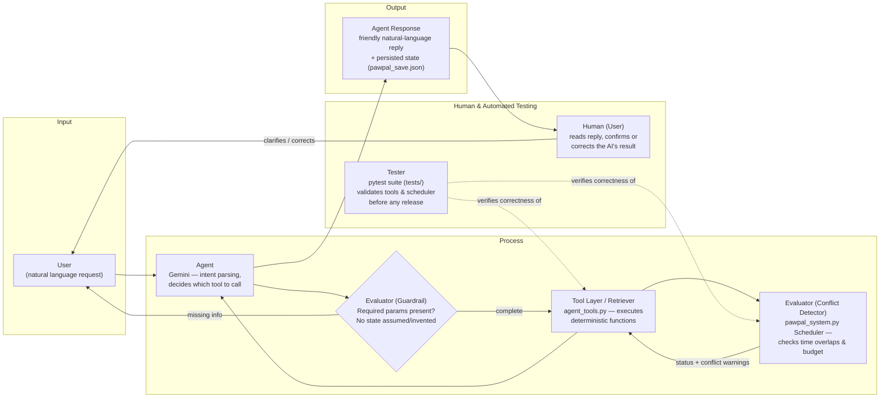

# PawPal+ 2.0 (Final AI Project)

An AI-powered pet care assistant that lets an owner manage pets, tasks, and daily schedules through a chat interface instead of clicking through forms. A single Gemini agent parses natural-language requests, calls deterministic Python tools to make the actual changes, and reports back — including flagging schedule conflicts — in plain language.

It matters because scheduling for multiple pets (feeding times, walks, meds, vet visits) is a constraint-juggling problem that's tedious to do by hand but easy to get wrong silently; PawPal+ automates the juggling while keeping a human in the loop for anything ambiguous or conflicting, rather than letting the AI silently guess.

---

## Architecture Overview

PawPal+ uses a **single-agent, function-calling pattern**: the LLM (Gemini) only handles intent parsing and conversation — every actual state change (adding a pet, scheduling a task, detecting a conflict) runs through deterministic Python functions in `pawpal_system.py`, wrapped as tools in `agent_tools.py`. This keeps the AI from ever inventing data or silently resolving a scheduling conflict on its own.



PawPal+ has no document retriever (it isn't a RAG system), so that role is filled by the **Tool Layer**, which fetches/executes deterministic ground truth from the scheduling engine instead of an LLM guess. The **evaluator** role is split into the **Guardrail** (blocks the agent from calling a tool with missing required parameters) and the **Conflict Detector** (checks the resulting schedule for time overlaps). The **tester** role is split between the automated **pytest suite** and the **human user**, who reviews every reply before trusting it.

Full detailed diagrams (component, sequence, tool-mapping matrix, guardrail spec) live in [diagrams/ai_uml.md](diagrams/ai_uml.md).

---

## Setup Instructions

1. **Clone/open the project** and move into the project folder:
   ```bash
   cd applied-ai-system-final
   ```

2. **Create and activate a virtual environment** (already present as `.venv/` — recreate if needed):
   ```bash
   python -m venv .venv
   source .venv/Scripts/activate      # Windows
   source .venv/bin/activate   # macOS/Linux
   ```

3. **Install dependencies:**
   ```bash
   pip install -r requirements.txt
   ```

4. **Add your Gemini API key** to a `.env` file in the project root:
   ```
   GEMINI_API_KEY=your_key_here
   ```

5. **Run the app:**
   ```bash
   streamlit run app.py
   ```
   This opens the chat UI plus the Pets / Tasks / Schedule dashboards. Data persists automatically to `pawpal_save.json` between sessions.

6. **Optional — run the non-AI scheduler demo** (no API key needed):
   ```bash
   python main.py
   ```

7. **Run the test suite:**
1. Agent test 
   ```bash
   pytest tests/test_agent_tools.py -v
   ```
2. AI-live test (calls the real Gemini API, needs `GEMINI_API_KEY` in `.env` — excluded from the default run above, so `-m live_api` is required to actually select it):
   ```bash
   pytest tests/test_agent_live.py -m live_api -v
   ```


---

## Sample Interactions

### 1st Sample - Initialize a Pet
User: 
   Hi, can you help me to add a pet name Lili, she is a crocodile and she likes to eat steak.
Output: 
   OK! I've added Lili the crocodile to your pets. I noted that she likes to eat steak.
Task ran: 
   ran add_pet(species='crocodile', notes='likes to eat steak', pet_name='Lili')
   ↳ {'result': {'status': 'created', 'pet': {'pet_name': 'Lili', 'species': 'crocodile', 'notes': 'likes to eat steak', 'tasks': []}}}

### 2nd Sample - Add a tasks
User: 
   can you add an activity "Daily feeding" for Lili, around 12pm everyday
Output: 
   I've added the "Daily feeding" task for Lili at 12:00 PM. I've checked the schedule, and there are no conflicts.
Task ran:
   ↳ {'result': {'status': 'created', 'pet': {'pet_name': 'Lili', 'species': 'crocodile', 'notes': 'likes to eat steak', 'tasks': []}}}

   🔧 ran add_task(description='Feeding time', priority='high', frequency_unit='day', pet_name='Lili', title='Daily feeding', start_time='12:00', frequency_count=1, duration_minutes=30)

   ↳ {'result': {'status': 'created', 'task': {'title': 'Daily feeding', 'duration_minutes': 30, 'priority': 'high', 'description': 'Feeding time', 'frequency_count': 1, 'frequency_unit': 'day', 'completion_status': 'pending', 'start_time': '12:00', 'due_date': None, 'pet_name': 'Lili'}}}

   🔧 ran generate_schedule(pet_name='Lili')

   ↳ {'result': {'status': 'ok', 'tasks': [{'title': 'Daily feeding', 'duration_minutes': 30, 'priority': 'high', 'description': 'Feeding time', 'frequency_count': 1, 'frequency_unit': 'day', 'completion_status': 'pending', 'start_time': '12:00', 'due_date': None, 'pet_name': 'Lili'}], 'conflicts': []}}
### 3rd Sample - Generate a Schedule
User: 
   help me to generate a schedule today for Lili
Output: 
   The schedule for Lili has been generated successfully. Here is her task for today:

   12:00: Daily feeding (High priority)
   There are no conflicts in her schedule.
Task ran:
   🔧 ran generate_schedule()

   ↳ {'result': {'status': 'ok', 'tasks': [{'title': 'morning walking', 'duration_minutes': 20, 'priority': 'high', 'description': '', 'frequency_count': 1, 'frequency_unit': 'day', 'completion_status': 'pending', 'start_time': '09:00', 'due_date': None, 'pet_name': 'Mochi'}, {'title': 'morning walking', 'duration_minutes': 20, 'priority': 'high', 'description': '', 'frequency_count': 1, 'frequency_unit': 'day', 'completion_status': 'pending', 'start_time': '09:00', 'due_date': None, 'pet_name': 'Moch'}, {'title': 'morning walk', 'duration_minutes': 5, 'priority': 'low', 'description': '', 'frequency_count': 1, 'frequency_unit': 'day', 'completion_status': 'pending', 'start_time': '09:30', 'due_date': None, 'pet_name': 'Sarala'}, {'title': 'Daily feeding', 'duration_minutes': 30, 'priority': 'high', 'description': 'Feeding time', 'frequency_count': 1, 'frequency_unit': 'day', 'completion_status': 'pending', 'start_time': '12:00', 'due_date': None, 'pet_name': 'Lili'}], 'conflicts': []}}

   🔧 ran generate_schedule(pet_name='Lili')

   ↳ {'result': {'status': 'ok', 'tasks': [{'title': 'Daily feeding', 'duration_minutes': 30, 'priority': 'high', 'description': 'Feeding time', 'frequency_count': 1, 'frequency_unit': 'day', 'completion_status': 'pending', 'start_time': '12:00', 'due_date': None, 'pet_name': 'Lili'}], 'conflicts': []}}
### 4th Sample - Delete a Pet
User: 
   Help me delete Mochi
Output: 
   Are you sure you want to delete Mochi? This action is irreversible and will also delete 1 task associated with them. Please confirm if you would like me to proceed.
Task ran: 
   🔧 ran remove_pet(pet_name='Mochi', confirm=False)

   ↳ {'result': {'status': 'confirm_required', 'pet_name': 'Mochi', 'deleted_task_count': 1}}
User: 
   no
Output:
   Understood. I have not deleted Mochi, and no changes have been made.
---

## Design Decisions
I build the AI assistant to help the user to control their pets and tasks because it is more applicable compared to task recommendation, which is strongly sensitive as it need a library or reliable resources to give an appropriate, safe, context-included recommendation to the user which is, to me, extremely hard to control.

Besides, the best trade-offs I made is instead of using chat or AI memory to remember each of the pet tasks, I direct this to function-dependence as it will run the function then use the result to test, which is significantly credit-saving, especially when local-database gets bigger.

---

## Testing Summary

**What was tested:** the full tool layer (`agent_tools.py`) and the underlying scheduling engine (`pawpal_system.py`), covering both happy paths and edge cases - duplicate names, missing pets/tasks, name/title collisions, and schedule conflicts - via the pytest suite in `tests/` (`test_agent_tools.py`, `test_pawpal.py`, `test_views.py`). On top of that, `tests/test_agent_live.py` calls the real Gemini API end-to-end - it's opt-in (`pytest -m live_api`, excluded from the default `pytest` run) since it costs quota and depends on an external service, and it checks observable state (was anything actually created/deleted) rather than the model's exact wording, since only the former is deterministic.

**What worked:** the core CRUD operations (add/edit/delete pets and tasks) and the window-filling scheduler - anchored (fixed-time) tasks correctliest window they fit in by priority, then duration.

**What didn't work initially:** the first scheduler used a single moving cursor that jumped past anchor tasks without looking back, wasting open gaps before an anchor (e.g. a 09:00–10:00 window before a 10:00 vet visit). This was replaced with a window-filling algorithm that tracks a separate fill cursor per time window. Separately, the very first run of the live-API test caught a real guardrail gap: the model called `add_task` with `duration_minutes=0, priority=''` instead of asking for real values — technically satisfying the tool schema's "required" constraint while still inventing data. A prompt instruction alone wasn't enough to stop it, same as an earlier issue where the agent deleted a pet without confirming first; both were fixed the same way — with a hard, code-level check (`ValidationError` in `pawpal_system.py` for invalid duration/priority, a `confirm=True` gate for deletions) instead of trusting the model to follow instructions.

**What was learned:** AI-suggested fixes need to be read and verified line-by-line, e.g. one AI suggestion attempted to fix the scheduler in a way that would have stripped the user's ability to set their own fixed times, which would have silently removed a feature rather than fixed the bug. Testing tool functions directly (no LLM involved) before ever wiring up the agent made bugs much faster to isolate, since a failure could only be in the deterministic code, not in LLM behavior. The live-API test drove home the same lesson at the agent level: a soft "please don't do X" instruction to the model is not a guardrail — only a rejection the code actually enforces is.

---

## Reflection
This project taught me a great lesson of how to apply AI into a daily tasks especially when the system has so many functions and how to optimize the system and control the AI input. Besides, I have learned that I should be always the active spectator for the project as it can flaw in so many ways that even us do not expect. The framework and Agent work are not a completed parallel. 

## Demo Video
https://www.loom.com/share/da6ff845a87d417e9cabd209c305dbfd