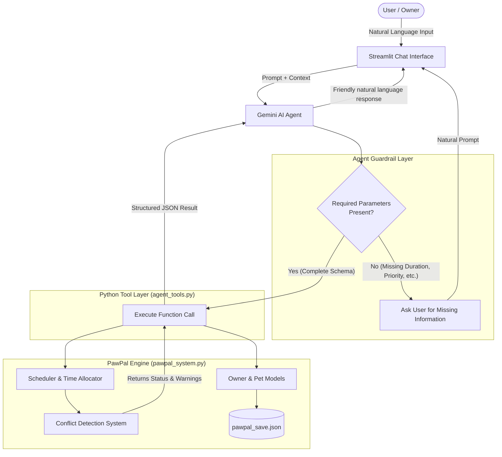

# PawPal+ AI System Architecture & Agent Workflow

This document outlines the design, tool integration layer, and decision flow for the AI Agent implementation in **PawPal+**. The architecture enforces a **Single-Agent Function-Calling Pattern**, utilizing deterministic Python functions (`pawpal_system.py`) for business logic and conflict calculations while keeping the LLM focused on intent parsing and conversation.

---

## 0. System Overview

PawPal+ doesn't use a document retriever (no RAG), so the "retriever" role is filled by the **Tool Layer**, which fetches/executes deterministic ground truth from the pet-scheduling engine instead of an LLM guess. The **evaluator** role is filled by the **Guardrail + Conflict Detector**, which checks the agent's requested action against required-parameter rules and scheduling conflicts before anything is treated as final. The **tester** role is split between the automated **pytest suite** (`tests/`) and the **human user**, who reviews every natural-language response before trusting or acting on it.

## 1. High-Level Architecture Diagram



## 2. Sequence Diagram: Interaction & Conflict flow

```
sequenceDiagram
    autonumber
    actor User as User
    participant UI as Streamlit UI
    participant LLM as Gemini Agent
    participant Tool as Tool Layer
    participant System as pawpal_system.py

    --- SCENARIO 1: INCOMPLETE COMMAND ---
    Note over User, System: Scenario 1: Ambiguous / Incomplete Request
    User->>UI: "Add a walk for Mochi"
    UI->>LLM: Send message history & prompt
    Note over LLM: Validates required params for add_task tool.<br/>Missing: duration_minutes, priority
    LLM-->>UI: "How long is the walk (min), and what priority should it have?"
    UI-->>User: Display clarification request

    --- SCENARIO 2: COMPLETE COMMAND WITH CONFLICT ---
    Note over User, System: Scenario 2: Execution & Conflict Detection
    User->>UI: "30 minutes, high priority, fixed at 09:00 AM"
    UI->>LLM: Send context update
    LLM->>Tool: tool_add_task(pet_name="Mochi", title="Walk", duration=30, priority="high", start_time="09:00")
    Tool->>System: pet.add_task(...)
    Tool->>System: Scheduler(tasks).schedule()
    System-->>Tool: ScheduleResult(tasks, conflicts=["WARNING [SAME PET: Mochi] 'Walk' (09:00) overlaps 'Grooming' (09:00)"])
    Tool-->>LLM: {"status": "conflict_warning", "conflicts": [...]}
    LLM-->>UI: "I added 'Walk' at 9:00 AM, but Mochi already has 'Grooming' scheduled then. Should we move one?"
    UI-->>User: Display final response & conflict notice
```
## 3.Tool Maping Matrix
The agent operates strictly through function calls defined in agent_tools.py, which wrap the methods of pawpal_system.py:

Agent Tool Function	- Backend Method - Description - Guardrail / Exception Behavior
1. tool_add_pet - Owner.add_pet() - Registers a new pet - Checks if pet already exists; rejects pet_name/species over 50 words or notes over 200 words with `{"status": "invalid_input"}` before creating anything; blocks creation past 500 pets for the owner; flags an unrecognized species with a non-blocking `"warning"` key.
2. tool_edit_pet - Owner.edit_pet() - Edits species, notes, or renames pet	 - Prevents duplicate pet name collisions; rejects new_name/species over 50 words or notes over 200 words with `{"status": "invalid_input"}`; flags an unrecognized species with a non-blocking `"warning"` key.
3. tool_add_task - Pet.add_task() - Appends task to a pet - Requires duration & priority before execution; rejects description over 200 words with `{"status": "invalid_input"}`.
4. tool_edit_task - Pet.edit_task() - Modifies existing task fields - Fails gracefully if task title is not found; rejects description over 200 words with `{"status": "invalid_input"}`.
5. tool_delete_task - Pet.delete_task()	- Removes task by title	- Asks confirmation if deleting triggers orphaned dependencies.
6. tool_generate_schedule	- Scheduler.schedule() - Builds day plan & checks window - Triggers conflict reporting if budget is exceeded or overlaps occur.
7. tool_check_slots - Scheduler.find_available_slots() - Finds open time blocks - Returns available (start, end) tuples for a given duration.

## 4. System Prompt Guardrail Specifications

Strict Non-Assumption Rule: 
1. The model must never invent missing function parameters (e.g., duration, start time, or priority). If incomplete, it must pause and ask the user.

2. ransparent Error Propagation: Any output returned by Scheduler.detect_conflicts() must be directly explained to the user in human-readable terms.

3. Deterministic State Synchronization: All tool state modifications must trigger a call to save_owner() to guarantee data persistence.

4. Input Bound Guardrail: We can't stop a user from hallucinating or acting in bad faith, but the tool layer bounds the blast radius cheaply, with no extra LLM call and no content moderation needed:
   - `owner_name`, `pet_name`, and `species` are capped at 50 words each; task `description` and pet `notes` are capped at 200 words each. Enforced in `pawpal_system.py` (`Owner.add_pet`/`edit_pet`, `Pet.add_task`/`edit_task`) via `ValidationError`, so it applies whether the request came from the agent or the manual Pets/Tasks pages. Every `agent_tools.py` wrapper catches `ValidationError` and returns `{"status": "invalid_input", "reason": "..."}` instead of raising into the function-calling loop — the model must relay `reason` back to the user rather than retrying with guessed values.
   - The pet list is capped at 500 pets per owner (`MAX_PETS_PER_OWNER` in `pawpal_system.py`); `tool_add_pet` returns `{"status": "invalid_input"}` once the cap is hit for a genuinely new name (re-adding an existing name is unaffected).
   - Species allowlist (`RECOGNIZED_SPECIES` in `pawpal_system.py`, informed by common companion-animal legality — dogs/cats, small domesticated mammals, rabbits, common cage birds, non-venomous snakes, common freshwater fish): an unrecognized species does **not** block pet creation/edit, but `tool_add_pet`/`tool_edit_pet` attach a `"warning"` key that the model must relay to the user verbatim (same pattern as `Scheduler.detect_conflicts()` conflict strings) — nudging the user to check local regulations rather than gatekeeping legitimate but unlisted pets.
   - `duration_minutes` (must be a positive integer), `priority` (must be `high`/`medium`/`low`), and `frequency_unit` (must be `day`/`week`/`month`/`as_needed`) are validated in `Pet.add_task`/`edit_task` via `check_duration`/`check_priority`/`check_frequency_unit`, same `ValidationError` → `{"status": "invalid_input"}` path as above. Added after a live test caught the model calling `add_task` with `duration_minutes=0, priority=''` instead of asking — the Non-Assumption Rule alone wasn't sufficient, this closes the gap the schema's "required" constraint doesn't cover.

5. Confirm-Then-Execute Rule: `remove_pet` and `delete_task` are destructive and irreversible, so neither ever deletes on a model's first call — both default to `confirm=False` and return `{"status": "confirm_required", ...}` (including how many tasks a pet-removal would take with it) instead. The model must surface that impact and wait for the user's explicit confirmation before calling the same tool again with `confirm=True`. This guardrail lives in the tool itself, not just the prompt, after an earlier version (prompt-only) was found to delete without asking.

6. Anti-Fabrication Rule: guessing a *plausible* value (e.g. defaulting an unstated duration to 30 minutes, or priority to "high") is exactly as much a Non-Assumption Rule violation as guessing an invalid one — input-bound validation can't catch this, since a plausible guess passes every check a real user-given value would. Caught live: the model filled in `duration_minutes=30, priority="high", start_time="09:00"` for "add a walk for Mochi" with none of those stated. Mitigated at the prompt level with an explicit worked example of the exact mistake and the question to ask instead — inherently probabilistic, not a hard guarantee the way the code-level checks above are.